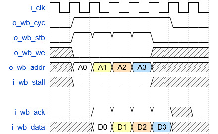
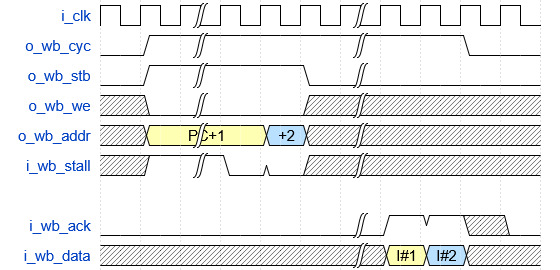
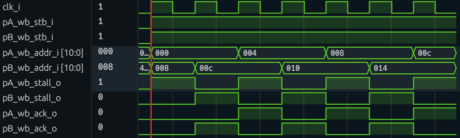

# Lab 3 

Your task is to design, test, and lay out a 2-port wishbone-accessible RAM.
- This ram will have 2 ports and be 2KB in size
- This ram will be composed of 2 DFFRAM macros, which each have one port.
  - Each DFFRAM will have 256 words of 32 bits, for a total of 1024 bytes.
  - If both ports of your ram access different DFFRAM macros, all is well.
  - If both ports try to access the same chunk of memory, your design will have to send delegate access such that each port takes turns.
    - This will be accomplished by driving a stall signal.
- Both ports of your ram will be compatible with the pipelined wishbone interface.
  - For a refresher on wishbone, check out [this link by ZipCPU](https://zipcpu.com/zipcpu/2017/05/29/simple-wishbone.html)

# Part 1: RTL Design and Testing
## Signal Naming
There are many ways of naming bus signals. We are going to go with the following convention:
`<port>_<signal>_<direction>`

For Example, the `wb_addr` signal on port A is an input to your RAM. It would be named:
`pA_wb_addr_i`

## Signal Waveforms
Your basic building block is the DFFRAM module. It gives you a ram with a single read/write port, and interfaces as follows.


Each port of your ram must be accessible in a single cycle with pipelined access, with a waveform as follows. Your module is only driving the stall, ack, and data signals; the rest are driven by your testbench.



In the case that both ports attempt to access the same inner DFFRAM, you will have to drive the stall signal.



Here is an example of both ports accessing the same part of memory and having to take turns.



## Downloading DFFRAM

1. Create a directory called `macros` to hold your macros. 
2. Within it, create a directory called `dffram256x32` to hold your dffram macro.
3. Navigate to the [Openlane DFFRAM repo](https://github.com/efabless/OL-DFFRAM). Click on releases and download the most recent `DFFRAM256x32` release. 
4. Copy this file into your dffram folder and `cd` into the folder.
4. Extract it using tar: `tar -xf *.gz`.

In summary:
```
mkdir macros/
mkdir macros/dffram256x32
cd macros/dffram256x32
wget https://github.com/efabless/OL-DFFRAM/releases/download/DFFRAM256x32-v1.0.2/v1.0.2.tar.gz
tar -xf *.gz
```

You now have all the necessary files to start working with dffram.
- There is a simulation model of the DFFRAM in `hdl/sim`. Copy it into your top level `rtl` directory to start using it in simulation.

# Part 2 - Macro Placement

Only start this section once your design is working in sim, and thoroughly tested with both verilator and icarus.

Openlane will take a long time to run for this section (20 minutes to an hour). To speed up its runtime, we can skip DRC checking until you are sure of your final design.
To do this, we can run openlane with specialized flags:
```
openlane <config.json> --flow Classic --skip magic.drc --skip klayout.drc
```

## Defining Die Area

In the past, we let the tools pick the size of our design based on our logic. However, now that we are manually placing it ourselves, we want to specify the size ourselves. This is done by setting the bottom left and top right corners in the form `[x0, y0, x1, y1]`, in units of micrometers.
- Setting our design too small will cause our macro placement or routing to fail
- The larger we set the design, the longer the tools will take
- Generally we will start the design large and iteratively shrink it.

<table><tr><td> Json </td> <td> Yaml </td></tr><tr><td>

```Json
{
    "FP_SIZING": "absolute",
    "DIE_AREA": [0, 0, 2000, 2000]  
}
```

</td><td>

```Yaml
---
FP_SIZING: absolute
DIE_AREA:
  - 0
  - 0
  - 2000
  - 2000
```

</td></tr></table>

## Defining Power Rails

Macro placement requires specifically named power and ground nets. The default names are `VPWR` and `VGND`.

<table><tr><td> Json </td> <td> Yaml </td></tr><tr><td>

```Json
{
    "VDD_NETS": [
      "VPWR"
  ],
    "GND_NETS": [
        "VGND"
    ]
}
```

</td><td>

```Yaml
---
VDD_NETS:
- VPWR
GND_NETS:
- VGND
```

</td></tr></table>

## Macro Placement

The `MACROS` section defines where macros are placed and with what orientation. It also defines where all the necessary design and timing files are used.

When placing macros, the user has control over:
- Position
  - X and Y coordinates specify the bottom left corner of the macro rectangle.
- Rotation
  - `N`,`S`,`E`, or `W` correspond to the cardinal directions (by default north)
- Mirroring
  - Add an `F`, for example `FN`,`FS`,`FE`, or `FW` to flip/mirror the macro


Generally, macros requires the following files:
- Layout Files
  - gds or gds.gz: layout of all layers
  - lef: layout of pin locations
- Timing Files
  - lib: cell timing
  - spef: wire parasitics (RC)
- Netlist Files
  - nl: verilog netlist
  - pnl: powered netlist

A full list can be found of macro filetypes can be found [here](https://openlane2.readthedocs.io/en/latest/reference/api/config/index.html#openlane.config.Macro)

<table><tr><td> Json </td> <td> Yaml </td></tr><tr><td>

```Json
{
 
   "MACROS": {
      "modulename": {
          "instances": {
          "instance1": {
              "location": ["x coord", "y coord"],
              "orientation": "N,S,E,W, or flipped: FN, FS, etc."
          },
          "instance2": {
              "location": [100, 750],
              "orientation": "FS"
          }
        },
          "gds": [
              "dir::path_to/gds/macro.gds"
          ],
          "lef": [
              "dir::path_to/lef/macro.lef"
          ],
          "spef": {
              "max*": [
                "dir::path_to/spef/max_/macro.max.spef"
              ],
              "min*": [
                "dir::path_to/spef/min_/macro.min.spef"
              ],
              "nom*": [
                "dir::path_to/spef/nom_/macro.nom.spef"
              ]
          },
          "lib": {
              "*": "dir::path_to/lib/max_ss_100C_1v60/macro__max_ss_100C_1v60.lib"
          },
          "nl": [
            "dir::path_to/nl/macro.nl.v"
          ],
          "pnl": [
            "dir::path_to/pnl/macro.pnl.v"
          ]
      }
     }
  
}
```

</td><td>

```Yaml
---
MACROS:
  modulename:
    instances:
      instance1:
        location:
        - x coord
        - y coord
        orientation: 'N,S,E,W, or flipped: FN, FS, etc.'
      instance2:
        location:
        - 100
        - 750
        orientation: FS
    gds:
    - dir::path_to/gds/macro.gds
    lef:
    - dir::path_to/lef/macro.lef
    spef:
      max*:
      - dir::path_to/spef/max_/macro.max.spef
      min*:
      - dir::path_to/spef/min_/macro.min.spef
      nom*:
      - dir::path_to/spef/nom_/macro.nom.spef
    lib:
      "*": dir::path_to/lib/max_ss_100C_1v60/macro__max_ss_100C_1v60.lib
    nl:
    - dir::path_to/nl/macro.nl.v
    pnl:
    - dir::path_to/pnl/macro.pnl.v

```

</td></tr></table>

## Connecting Macro to Power
By default, Openlane has no way to know which pins in your macro are power and ground. To connect your power distribution network to that of the macro, use the `PDN_MACRO_CONNECTIONS` variable. 

<table><tr><td> Json </td> <td> Yaml </td></tr><tr><td>

```Json
{
       "PDN_MACRO_CONNECTIONS": [
        "instance1 VPWR VGND VPWR VGND",
        "instance2 VPWR VGND VPWR VGND"
      ]
}
```

</td><td>

```Yaml
---
PDN_MACRO_CONNECTIONS:
- instance1 VPWR VGND VPWR VGND
- instance2 VPWR VGND VPWR VGND

```

</td></tr></table>

## Configuring the PDN

It is very important that all parts of our chip get power. The Power Distribution Network (PDN) of our chip needs to integrate with that of the macros we are using. To ensure our PDN correctly overlaps the PDN of the macro, we have to add PDN configuration.

Additionally, we will declare a core_ring that creates a ring of power and ground around our chip. This way, our block can be used as a macro later on.

<table><tr><td> Json </td> <td> Yaml </td></tr><tr><td>

```Json
{
    "FP_PDN_VOFFSET": 5,
    "FP_PDN_HOFFSET": 5,
    "FP_PDN_VWIDTH": 3.1,
    "FP_PDN_HWIDTH": 3.1,
    "FP_PDN_VSPACING": 15.5,
    "FP_PDN_HSPACING": 15.5,
    "FP_PDN_VPITCH": 100,
    "FP_PDN_HPITCH": 100,

    "FP_PDN_CORE_RING": true,
    "FP_PDN_CORE_RING_VWIDTH": 3.1,
    "FP_PDN_CORE_RING_HWIDTH": 3.1,
    "FP_PDN_CORE_RING_VOFFSET": 12.45,
    "FP_PDN_CORE_RING_HOFFSET": 12.45,
    "FP_PDN_CORE_RING_VSPACING": 1.7,
    "FP_PDN_CORE_RING_HSPACING": 1.7
}
```

</td><td>

```Yaml
---
FP_PDN_VOFFSET: 5
FP_PDN_HOFFSET: 5
FP_PDN_VWIDTH: 3.1
FP_PDN_HWIDTH: 3.1
FP_PDN_VSPACING: 15.5
FP_PDN_HSPACING: 15.5
FP_PDN_VPITCH: 100
FP_PDN_HPITCH: 100

FP_PDN_CORE_RING: true
FP_PDN_CORE_RING_VWIDTH: 3.1
FP_PDN_CORE_RING_HWIDTH: 3.1
FP_PDN_CORE_RING_VOFFSET: 12.45
FP_PDN_CORE_RING_HOFFSET: 12.45
FP_PDN_CORE_RING_VSPACING: 1.7
FP_PDN_CORE_RING_HSPACING: 1.7
```

</td></tr></table>

https://openlane2.readthedocs.io/en/latest/usage/caravel/index.html
  
  ## Fixing Antennae Violations

When using much larger die areas than we have before, we are much more likely to run into antennae violations. This is because our wires now have to span much more distance. In order to solve this, we have to tell the tools to do a lot more work on fixing antennaes. 

<table><tr><td> Json </td> <td> Yaml </td></tr><tr><td>

```Json
{
    "PL_RESIZER_ALLOW_SETUP_VIOS": true,
    "GRT_RESIZER_ALLOW_SETUP_VIOS": true,
    "GRT_ANTENNA_ITERS": 15,
    "GRT_ANTENNA_MARGIN": 15,
    "RUN_HEURISTIC_DIODE_INSERTION": true,
    "DESIGN_REPAIR_MAX_WIRE_LENGTH": 800,
    "PL_WIRE_LENGTH_COEF": 0.05,
    "RUN_POST_GRT_DESIGN_REPAIR": true,
    "DESIGN_REPAIR_MAX_SLEW_PCT": 30,
    "DESIGN_REPAIR_MAX_CAP_PCT": 30,
    "MAX_TRANSITION_CONSTRAINT": 1.5
}
```

</td><td>

```Yaml
---
PL_RESIZER_ALLOW_SETUP_VIOS: true
GRT_RESIZER_ALLOW_SETUP_VIOS: true
GRT_ANTENNA_ITERS: 15
GRT_ANTENNA_MARGIN: 15
RUN_HEURISTIC_DIODE_INSERTION: true
DESIGN_REPAIR_MAX_WIRE_LENGTH: 800
PL_WIRE_LENGTH_COEF: 0.05
RUN_POST_GRT_DESIGN_REPAIR: true
DESIGN_REPAIR_MAX_SLEW_PCT: 30
DESIGN_REPAIR_MAX_CAP_PCT: 30
MAX_TRANSITION_CONSTRAINT: 1.5


```

</td></tr></table>

# Part 3 - Gate Level Simulation

Gate level simulation with macros can be complicated. Generally it can be accomplished with the following steps:
1. Create a folder called `gl` and copy the gate level netlist of your macro into it. The netlist should be in the `hdl/gl` directory of your macro. It is either a `.v` or `.pnl.v` file.
2. Adjust the hierarchy of your waveform by using:

>```Verilog
>$dumpvars(2, tb_mem);
>```
>This sets your output to 2 levels of saved hierarchy. If you save the whole hierarchy, your dumpfile will be too large to open.

3. Follow all gate level steps from [this link](https://github.com/Cal-Poly-Open-Source-ASIC-Class/lab2/issues/1)
4. Run `make gl_tests`
5. If changes need to be made to your design, it must be re-run through openlane first.

  # Deliverables
  - RTL for 2-Port Wishbone RAM
  - Testbench with tasks for reading/writing each ram port
    - Includes concurrent tests on both ports to demonstrate collisions and delegation
  - Openlane Configuration for Macro Placement
  - Screenshots of final placed macro design
  - Gate Level Testing
    - This is worth a small amount of points due to difficulty. Don't sink too much time into it.